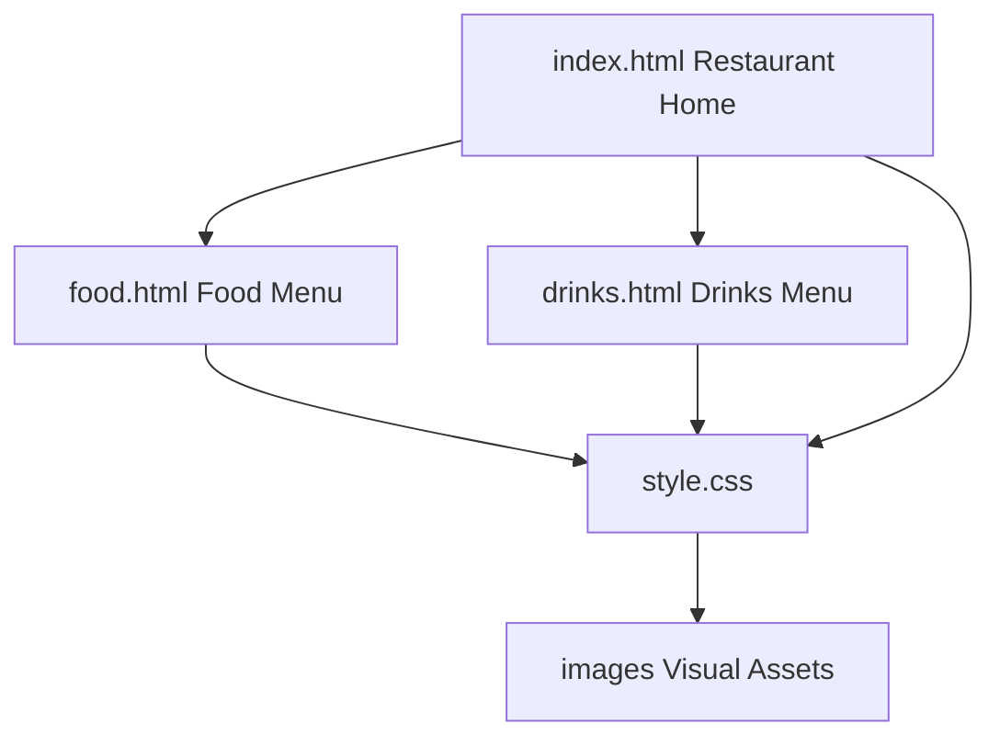
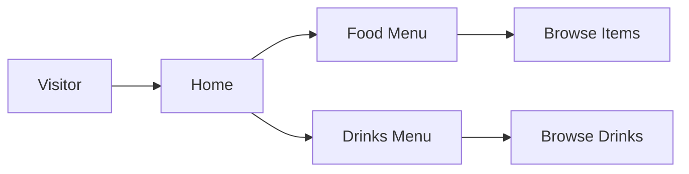

# S-V Bar & Restaurant

A responsive, image-led restaurant website for presenting food and drinks menus through a polished, lightweight frontend.

## Highlights
- Responsive landing page
- Dedicated food menu
- Dedicated drinks menu
- Image-rich menu presentation
- Clean navigation and shared styling
- No backend dependency

## Architecture
```text
S-V-Bar-Restaurant/
├── index.html
├── food.html
├── drinks.html
├── style.css
└── images/
```

### Page flow
```text
index.html
   ├──→ food.html
   └──→ drinks.html
          ↓
       style.css
          ↓
       images/
```

## Tech Stack
HTML5, CSS3, responsive design, local image assets.

## Run locally
Open `index.html` directly in a browser or use any static web server. The project is suitable for static hosting such as GitHub Pages.


## Visual Architecture



## Visitor Flow



## Project Structure

| File / Folder | Purpose |
|---|---|
| `index.html` | Restaurant landing page |
| `food.html` | Food menu |
| `drinks.html` | Drinks menu |
| `style.css` | Shared responsive styling |
| `images/` | Website visual assets |
